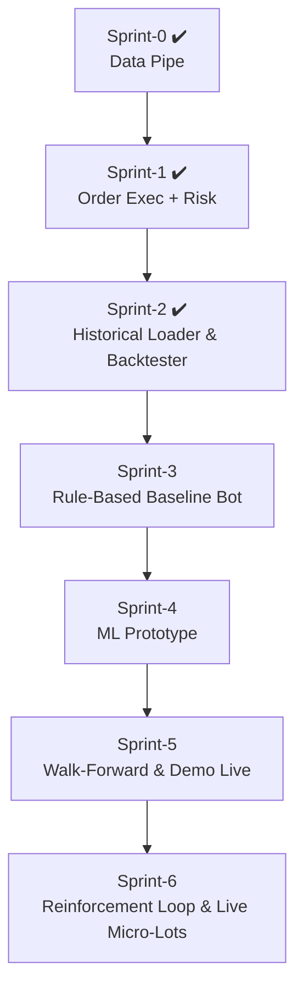

# EdgeFlow Trader

> **Mission:** transform a discretionary USDJPY scalping edge into a fully-automated, AI-enhanced trading machine that runs 24 / 5 on MT4.

---

## 1 Project Snapshot

| Piece | Status | Notes |
|-------|--------|-------|
| **MT4 EA** – tick logger & order listener | **✅ v0.1b** | Writes `ticks.csv`, echoes `orders.json`. |
| **Python Bridge** – CSV ↔ DB ↔ REST | **✅ v0.1d** | Streams ticks into TimescaleDB, exposes `POST /order`. |
| **TimescaleDB** | **✅** | Docker container `edgeflow-timescaledb`. |
| **Backtester / Strategy Sim** | **✅** | Rule-based logic → simulated PnL + equity tracking. |
| **Web Dashboard** – stats + equity curve | **✅** | Charts trades and shows win-rate, P&L on /dashboard. |
| **Order execution logic** | **✅ Sprint-1** | Parse JSON → `OrderSend()` + execution-ack. |
| **Risk engine / sizing rules** | **✅ Sprint-1** | 10 % max risk, 0.25-lot start, +0.25 per $200. |
| **Historical trade loader + analyzer** | **✅ Sprint-2** | Simulate, enrich, and extract win-rate/time-based insights. |
| **ML decision core** | 🚧 | Phase-4 roadmap. |

---

## 2 Quick Start (local dev)

```bash
# clone and enter repo
git clone https://github.com/AgentMrBig/EdgeFlow-Trader.git
cd EdgeFlow-Trader

# 1️⃣ start DB
docker compose -f docker/timescaledb-compose.yml up -d

# 2️⃣ build / attach EA in MT4
#    MetaEditor → open ea/EdgeFlowTrader.mq4 → Compile
#    Attach to USDJPY M1 chart (Auto-Trading ON)

# 3️⃣ run the bridge
cd bridge
python -m venv .venv && source .venv/Scripts/activate   # first time only
pip install -r requirements.txt                         # first time only
python main.py
```

### Smoke Test

```bash
curl -X POST http://localhost:8000/order \
     -H "Content-Type: application/json" \
     -d '{"symbol":"USDJPY","side":"buy","lot":0.01}'
```

*MT4* → **Experts** tab should show:

```
[EdgeFlow] ORDER RECEIVED -> {"symbol":"USDJPY","side":"buy","lot":0.01}
```

Check tick ingestion:

```bash
docker exec -it edgeflow-timescaledb \
  psql -U postgres -d edgeflow \
  -c "SELECT COUNT(*) FROM ticks;"
```

---

## 3 Web Dashboard

```bash
# from project root
cd webapp
uvicorn main:app --reload
```

Navigate to `http://127.0.0.1:8000`:

- View **total trades**, **win rate**, **cumulative P&L**
- Live **equity curve** chart powered by Chart.js + Luxon
- Navigation panel with toggleable dashboard views

Requires:  
- `backtest/simulated_trades.csv` → generated via `simulate_strategy.py`
- `equity_data.json` is generated on-demand via backend logic (no manual step)

---

## 4 Repo Structure

```text
EdgeFlow-Trader/
├─ ea/                         – MQL4 Expert Advisor source
├─ bridge/                     – FastAPI bridge & watcher
│   ├─ main.py                 – bridge app (v0.1d)
│   └─ main.toml               – path to MT4 Files folder
├─ backtest/                   – strategy testing + equity exporter + analysis
│   ├─ simulate_pnl.py         – simulates trades with TP/SL and logs result
│   ├─ trade_analyzer.py       – enriches trades with time-based insights
│   ├─ phase4_insights.py      – extracts patterns from enriched trades
│   ├─ phase5_recommend.py     – prints strategic suggestions for improvement
│   └─ export_equity_json.py   – exports data for dashboard charting
├─ webapp/                     – FastAPI + Jinja2 + Chart.js dashboard
│   ├─ main.py
│   ├─ templates/index.html
│   └─ static/equity_data.json
├─ docker/
│   └─ timescaledb-compose.yml
├─ docs/
│   ├─ techdoc.md              – architecture & sprint logs
│   ├─ protocol.md             – tick / order JSON schemas
│   └─ risk-config.yaml        – sizing & exposure rules
└─ README.md                   – this file
```

---

## 5 Dev Roadmap



---

## 6 Links & Docs

* **Protocol spec** – [docs/protocol.md](docs/protocol.md)  
* **Risk parameters** – [docs/risk-config.yaml](docs/risk-config.yaml)  
* **Strategy rules** – [docs/strategy-rules.md](docs/strategy-rules.md)  
* **Technical design log** – [docs/techdoc.md](docs/techdoc.md)

---

## 7 Branch & Commit Strategy

* **`main`** = deployable state (last green sprint).  
* Feature branches → PR → squash-merge into **`dev`** → fast-forward **`main`** on sprint release.  
* Commit prefixes: `feat:`, `fix:`, `doc:`, `refactor:`.

---

## 8 Phase 5 Insights

```
📋 Strategy Insights – Phase 5 Recommendations:

• ✅ Best hour to trade: 8:00 with win rate 44.07%
• ⚠️ Avoid trading on Monday (win rate 31.22%)
• ⏱ Consider closing trades after 45 min to avoid timeouts/losses (found 125 cases)
• 📈 8–9am ET has >30% win rate. Consider focusing entries during this window.
• 📊 Average trades per hour: 517.00
```

---

## 9 Next Up 🚀

1. **Sprint-3:** Rule-based baseline bot with simulation loop + evolving parameter sets.  
2. **ML onboarding:** Move enriched insights into features for ML model.  
3. **UI component:** Expose insights through webapp → performance by hour, weekday, duration.
