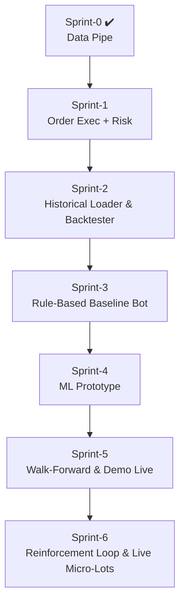

# EdgeFlow Trader

> **Mission:** transform a discretionary USDJPY scalping edge into a fully-automated, AI-enhanced trading machine that runs 24 / 5 on MT4.

---

## 1 Project Snapshot

| Piece | Status | Notes |
|-------|--------|-------|
| **MT4 EA** – tick logger & order listener | **✅ v0.1b** | Writes `ticks.csv`, echoes `orders.json`. |
| **Python Bridge** – CSV ↔ DB ↔ REST | **✅ v0.1d** | Streams ticks into TimescaleDB, exposes `POST /order`. |
| **TimescaleDB** | **✅** | Docker container `edgeflow-timescaledb`. |
| **Order execution logic** | 🔜 Sprint-1 | Parse JSON → `OrderSend()` + execution-ack. |
| **Risk engine / sizing rules** | 🔜 Sprint-1 | 10 % max risk, 0.25-lot start, +0.25 per $200. |
| **ML decision core** | 🚧 | Phase-4 roadmap. |

---

## 2 Quick Start (local dev)

```bash
# clone and enter repo
git clone https://github.com/AgentMrBig/EdgeFlow-Trader.git
cd EdgeFlow-Trader

# 1️⃣ start DB
docker compose -f docker/timescaledb-compose.yml up -d

# 2️⃣ build / attach EA in MT4
#    MetaEditor → open ea/EdgeFlowTrader.mq4 → Compile
#    Attach to USDJPY M1 chart (Auto-Trading ON)

# 3️⃣ run the bridge
cd bridge
python -m venv .venv && source .venv/Scripts/activate   # first time only
pip install -r requirements.txt                         # first time only
python main.py
```

### Smoke Test

```bash
curl -X POST http://localhost:8000/order \
     -H "Content-Type: application/json" \
     -d '{"symbol":"USDJPY","side":"buy","lot":0.01}'
```

*MT4* → **Experts** tab should show

```
[EdgeFlow] ORDER RECEIVED -> {"symbol":"USDJPY","side":"buy","lot":0.01}
```

Verify tick flow:

```bash
docker exec -it edgeflow-timescaledb \
  psql -U postgres -d edgeflow \
  -c "SELECT COUNT(*) FROM ticks;"
```

---

## 3 Repo Structure

```text
EdgeFlow-Trader/
├─ ea/                         – MQL4 Expert Advisor source
├─ bridge/                     – FastAPI bridge & watcher
│   ├─ main.py                 – bridge app (v0.1d)
│   └─ main.toml               – path to MT4 Files folder
├─ docker/
│   └─ timescaledb-compose.yml – one-liner DB stack
├─ docs/
│   ├─ techdoc.md              – architecture & sprint logs
│   ├─ protocol.md             – tick / order JSON schemas
│   └─ risk-config.yaml        – sizing & exposure rules
└─ README.md                   – this file
```

---

## 4 Dev Roadmap



---

## 5 Links & Docs

* **Protocol spec** – [docs/protocol.md](docs/protocol.md)  
* **Risk parameters** – [docs/risk-config.yaml](docs/risk-config.yaml)  
* **Strategy rules** – [docs/strategy-rules.md](docs/strategy-rules.md)  
* **Technical design log** – [docs/techdoc.md](docs/techdoc.md)

---

## 6 Branch & Commit Strategy

* **`main`** = deployable state (last green sprint).  
* Feature branches → PR → squash-merge into **`dev`** → fast-forward **`main`** on sprint release.  
* Commit prefixes: `feat:`, `fix:`, `doc:`, `refactor:`.

---

## 7 Next Up 🚀

1. **OrderSend implementation** inside the EA (market orders + error handling).  
2. **Execution-ack loop** – EA writes `executions.csv`; bridge ingests tickets into DB.  
3. **Risk guard** – enforce rules from `docs/risk-config.yaml` before queuing any order.  
4. **CI badges (optional)** – add lint/test workflow & Timescale health badge.
