# EdgeFlow Trader

> **Mission:** transform a discretionary USDJPY scalping edge into a fully-automated, AI-enhanced trading machine that runs 24 / 5 on MT4.

---

## 1 Project Snapshot

| Piece                                     | Status         | Notes                                                                                |
| ----------------------------------------- | -------------- | ------------------------------------------------------------------------------------ |
| **MT4 EA** – tick logger & order listener | **✅ v0.2**     | Writes `ticks.csv`, reads and executes from `orders.json`, logs to `executions.csv`. |
| **Python Bridge** – CSV ↔ DB ↔ REST       | **✅ v0.1d**    | Streams ticks into TimescaleDB, exposes `POST /order`.                               |
| **TimescaleDB**                           | **✅**          | Docker container `edgeflow-timescaledb`.                                             |
| **Backtester / Strategy Sim**             | **✅**          | Rule-based logic → simulated PnL + equity tracking.                                  |
| **Web Dashboard** – stats + equity curve  | **✅**          | Charts trades and shows win-rate, P\&L on /dashboard.                                |
| **Order execution logic**                 | **✅ Sprint-1** | `OrderSend()` implemented in EA with lot validation and logging.                     |
| **Risk engine / sizing rules**            | 🕸️ Sprint-2   | 10 % max risk, 0.25-lot start, +0.25 per \$200.                                      |
| **ML decision core**                      | 🚧             | Phase-4 roadmap.                                                                     |

---

## 2 Quick Start (local dev)

```bash
# clone and enter repo
git clone https://github.com/AgentMrBig/EdgeFlow-Trader.git
cd EdgeFlow-Trader

# 1️⃣ start DB
docker compose -f docker/timescaledb-compose.yml up -d

# 2️⃣ build / attach EA in MT4
#    MetaEditor → open ea/EdgeFlowTrader.mq4 → Compile
#    Attach to USDJPY M1 chart (Auto-Trading ON)

# 3️⃣ run the bridge
cd bridge
python -m venv .venv && source .venv/Scripts/activate   # first time only
pip install -r requirements.txt                         # first time only
uvicorn main:app --port 8001 --reload
```

### Smoke Test

```bash
curl -X POST http://localhost:8001/order \
     -H "Content-Type: application/json" \
     -d '{"symbol":"USDJPY","side":"buy","lot":0.01}'
```

*MT4* → **Experts** tab should show:

```
Raw order JSON: {"symbol": "USDJPY", "side": "buy", "lot": 0.01, "sl": null, "tp": null, "slippage": 3}
EXECUTED ticket=123456 lot=0.01 at 156.234
```

Check tick ingestion:

```bash
docker exec -it edgeflow-timescaledb \
  psql -U postgres -d edgeflow \
  -c "SELECT COUNT(*) FROM ticks;"
```

---

## 3 Web Dashboard

```bash
# from project root
cd webapp
uvicorn main:app --reload
```

Navigate to `http://127.0.0.1:8000`:

* View **total trades**, **win rate**, **cumulative P\&L**
* Live **equity curve** chart powered by Chart.js + Luxon
* Navigation panel with toggleable dashboard views

Requires:

* `backtest/simulated_trades.csv` → generated via `simulate_strategy.py`
* `equity_data.json` is generated on-demand via backend logic (no manual step)

---

## 4 Repo Structure

```text
EdgeFlow-Trader/
├─ ea/                         – MQL4 Expert Advisor source
├─ bridge/                     – FastAPI bridge & watcher
│   ├─ main.py                 – bridge app (v0.1d)
│   └─ main.toml               – path to MT4 Files folder
├─ backtest/                   – strategy testing + equity exporter
│   ├─ simulate_strategy.py
│   └─ export_equity_json.py
├─ webapp/                     – FastAPI + Jinja2 + Chart.js dashboard
│   ├─ main.py
│   ├─ templates/index.html
│   └─ static/equity_data.json
├─ docker/
│   └─ timescaledb-compose.yml
├─ docs/
│   ├─ techdoc.md              – architecture & sprint logs
│   ├─ protocol.md             – tick / order JSON schemas
│   └─ risk-config.yaml        – sizing & exposure rules
└─ README.md                   – this file
```

---

## 5 Dev Roadmap

```mermaid
graph TD
  A[Sprint-0 ✔️\nData Pipe] --> B[Sprint-1 ✔️\nOrder Exec + Risk]
  B --> C[Sprint-2\nHistorical Loader & Backtester]
  C --> D[Sprint-3\nRule-Based Baseline Bot]
  D --> E[Sprint-4\nML Prototype]
  E --> F[Sprint-5\nWalk-Forward & Demo Live]
  F --> G[Sprint-6\nReinforcement Loop & Live Micro-Lots]
```



---

## 6 Links & Docs

* **Protocol spec** – [docs/protocol.md](docs/protocol.md)
* **Risk parameters** – [docs/risk-config.yaml](docs/risk-config.yaml)
* **Strategy rules** – [docs/strategy-rules.md](docs/strategy-rules.md)
* **Technical design log** – [docs/techdoc.md](docs/techdoc.md)

---

## 7 Branch & Commit Strategy

* **`main`** = deployable state (last green sprint).
* Feature branches → PR → squash-merge into **`dev`** → fast-forward **`main`** on sprint release.
* Commit prefixes: `feat:`, `fix:`, `doc:`, `refactor:`.

---

## 8 Next Up 🚀

1. **Risk guard implementation** in the EA and bridge, enforcing rules from `docs/risk-config.yaml`.
2. **Backtest sync** – auto-export backtest results into TimescaleDB.
3. **Optimizer UI** – connect strategy parameters to dashboard frontend.
4. **Sprint-2 historical loader** for replays + strategy refinement.
