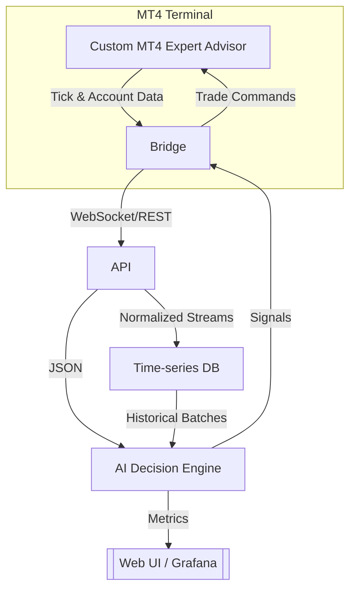

# 1 Vision & Objectives — “Forex AI Trading Bot”

## Purpose
Create a fully-automated, adaptive trading system that  

* **streams** live price data from MetaTrader 4 (MT4) via a custom Expert Advisor (EA);  
* **feeds** that data into an AI/ML decision engine trained on Erik’s strategy plus ongoing market feedback;  
* **executes, modifies, and closes** trades through the EA bridge—24 / 5—with strict risk controls;  
* **scales** from demo to live accounts with minimal manual intervention.

## Success Metrics

| Metric | Target | Notes |
|--------|--------|-------|
| Monthly equity growth | **≥ 5 %** | After 6-month stabilization period |
| Maximum drawdown | **≤ 10 %** | Based on closed-equity curve |
| Trade accuracy | **≥ 60 % win-rate** **or** positive expectancy ≥ 1.2 | Account-level |
| Deployment latency | **< 250 ms** MT4 tick → ML decision → order | Local LAN benchmark |

## Guiding Principles
* **Risk First** – position sizing & protective stops come before profit targets.  
* **Explainability** – AI decisions must be logged in plain English for review.  
* **Incremental Release** – each phase must be profitable (or at least flat) on demo before moving to live.  
* **Auditability** – all data, model versions, and trades are fully reproducible.  

---

# 2 System Overview & Component Breakdown

| Component | Responsibilities | Tech Stack Candidates |
|-----------|------------------|-----------------------|
| **MT4 EA** | Capture tick/OHLC & account events; forward/execute orders | MQL4 |
| **Bridge Service** | Low-latency socket or REST gateway between EA & back-end | C++, Rust, or Python (ZeroMQ / gRPC) |
| **API Layer** | Auth, routing, schema validation, rate-limiting | FastAPI / Starlette |
| **Data Store** | High-write TSDB for tick & feature logs | TimescaleDB or InfluxDB |
| **ML Core** | Feature engineering, model inference, reinforcement loop | PyTorch + stable-baselines3 |
| **Dashboard** | Equity curve, open trades, model health, logs | Next.js + Grafana/Loki |

### Key Interfaces
* **Protocol EA ↔ Bridge** – JSON over TCP socket (deterministic schema, heartbeat).  
* **Feature Vector Format** – `[timestamp, symbol, bid, ask, spread, ma10, ma50, …]`.  
* **Signal Contract** – `{"symbol":"USDJPY","side":"buy","lot":0.25,"sl":…,"tp":…}`.  

### Security & Reliability
* Auth tokens on every bridge/API call.  
* Execution-ack flow: Bridge confirms order ticket back to ML Core.  
* Redundant logging (EA file + API + DataStore) for forensic replay.  

---

# 3 Phased Roadmap & Milestones

| Phase | Goal | Deliverables | Target Duration |
|-------|------|--------------|-----------------|
| **0 – Requirements & Research** | Finalize specs, risk rules, hosting choice | Signed project charter | 1 week |
| **1 – EA Data Bridge (MVP)** | Stream live ticks ⇄ receive order cmds | MQL4 EA, Bridge service, schema docs | 2 weeks |
| **2 – Historical Data Ingestion** | Build time-series DB & loader | Raw tick/1-min candles, backfill scripts | 1 week |
| **3 – Baseline Strategy Bot** | Encode Erik’s current ruleset in code | Rule-based Python bot, backtest report | 2 weeks |
| **4 – ML Prototype** | Supervised model that mimics baseline | Feature pipeline, first model, offline metrics | 3 weeks |
| **5 – Backtesting & Walk-Forward** | Validate over 2+ yrs USDJPY | Backtest harness, walk-forward stats, risk analysis | 2 weeks |
| **6 – Demo Account Live Trial** | Deploy on demo, monitor 4-week sample | Deployment scripts, dashboard, daily reports | 4 weeks |
| **7 – Reinforcement & Auto-Tuning** | Add RL fine-tuning, dynamic sizing | Reward function, online training loop | 4 weeks |
| **8 – Production Go-Live** | Cut over to live micro-lot account | Run-books, on-call alerts, capital allocation plan | 1 week |

### Immediate Next Steps
1. Confirm / adjust success metrics & risk limits.  
2. Decide on language for Bridge (Python fast to iterate vs C++ ultra-low latency).  
3. Provide sample tick data or grant demo-account credentials for dev.  
4. Lock in hosting (local vs AWS EC2 + RDS/Timescale).  

### Open Questions for Erik
* Preferred risk profile (per-trade % and daily loss cap)?  
* Any regulatory/compliance constraints (NFA, FIFO, etc.)?  
* Symbols beyond USDJPY to support, or single-pair focus at launch?  
* Do we need mobile monitoring UI in v1?  
